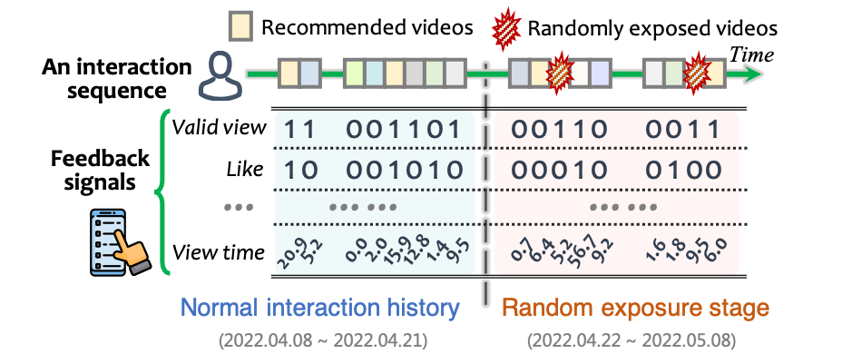
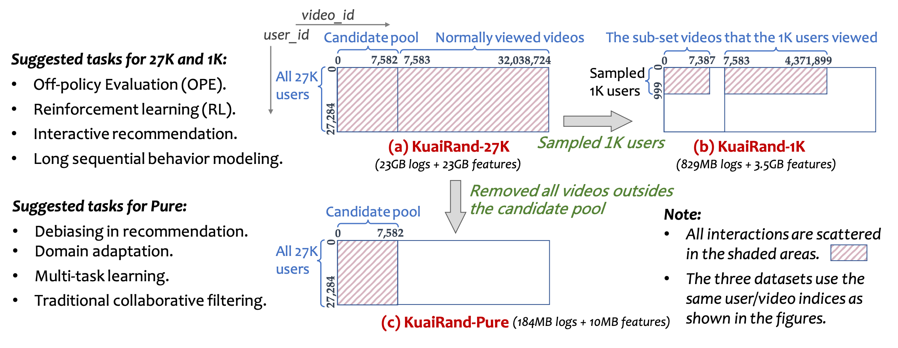

# KuaiRand: An Unbiased Sequential Recommendation Dataset with Randomly Exposed Videos 

[](https://github.com/chongminggao/KuaiRand/blob/main/LICENSE)

*KuaiRand* is an unbiased sequential recommendation dataset collected from the recommendation logs of the video-sharing mobile app, [Kuaishou (快手)](https://www.kuaishou.com/cn).  **It is the first recommendation dataset with millions of  intervened interactions of randomly exposed items inserted in the standard recommendation feeds!** 

## Overview:

The following figure gives an example of the dataset. It illustrates a user interaction sequence along with the user's rich feedback signals.



These feedback signals are collected from the two main user interfaces (UI) in Kuaishou APP shown as follows:


In the random exposure stage, each recommended video in the dataset has an equal probability being replaced by a random video sampled from an item pools. About $0.37\%$ Interactions are replaced in the final results. 

#### Advantages:

Compared with other datasets with random exposure, KuaiRand has the following advantages:

- ✅ It is the first sequential recommendation dataset with millions of  intervened interactions of randomly exposed items inserted in the standard recommendation feeds.
- ✅ It has the most comprehensive side information including explicit user IDs, interaction timestamps, and rich features for users and items.
- ✅ It has 15 policies with each catered for a special recommendation scenario in Kuaishou App.
- ✅ We introduce 12 feedback signals (e.g., click, like, and view time) for each interaction to describe the user's comprehensive feedback.
- ✅ Each user has thousands of historical interactions on average.
- ✅ It has three versions to support various research directions in recommendation.

----

## Three Versions and Suggestions:

We release three versions of KuaiRand for different usage:

- **KuaiRand-27K (23GB logs +23GB features):** the complete KuaiRand dataset that has over 27K users and 32 millions videos.
- **KuaiRand-1K  (829MB logs + 3.5GB features):** randomly sample 1,000 users from *KuaiRand-27K*, then remove all irrelevant videos. There are 4 millions videos rest. 
- **KuaiRand-Pure  (184MB logs + 10MB features):** only keeps the logs for the 7582 videos in the candidate pool. 

The *user_id* and *video_id* are re-indexed. A visualization of their ID spaces is shown as follows.



##### The basic statistics of the three versions are summarized as follows:

| Dataset          | Collection Policy  | #Users |   #Items   | #Interactions | #User features | #Item features | Feedback      | Timestamp |
| ---------------- | :----------------: | :----: | :--------: | :-----------: | :--------------: | :--------------: | :-------------: | :---------: |
| **KuaiRand-27K** |    15 policies     | 27,285 | 32,038,725 |  322,278,385  | 30             | 62            | 12 signals    | ✔️ |
|                  |   Random policy    | 27,285 |   7,583    |   1,186,059   | 30             | 62            | 12 signals    | 	✔️ |
| **KuaiRand-1K**  |    15 policies     | 1,000  | 4,369,953  |  11,713,045   | 30             | 62            | 12 signals    | ✔️ |
|                  |   Random policy    | 1,000  |   7,388    |    43,028     | 30             | 62            | 12 signals    | ✔️ |
| **KuaiRand-Pure**  |    15 policies     | 27,285 | 7,551 | 1,436,609 | 30             | 62            | 12 signals    | ✔️ |
|                  |   Random policy    | 27,285 | 7,583 | 1,186,059 | 30             | 62            | 12 signals    | ✔️ |


### Which version should I use?

- ##### Reasons to use *KuaiRand-27K* or *KuaiRand-1K*:

  - Your research needs rigorous sequential logs, such as off-policy evaluation (OPE), Reinforcement learning (RL), or long sequential recommendation.

- ##### Reasons to use *KuaiRand-Pure*:

  - The sequential information is not necessary in your research OR If you are OK with the incomplete sequential logs. For example, if you are studying debiasing in collaborative filtering models or multi-task modeling in recommendation.
  - If your model can only run with small-size data.


---


## Download the data

We provides several options to download the datasets:

#### Option 1. Download via the "wget" command.

##### KuaiRand-27K (compressed size: 9.21GB; uncompressed size: 46GB)

```shell
wget https://chongming.myds.me:61364/data/KuaiRand-27K.tar.gz --no-check-certificate
tar -zxvf KuaiRand-27K.tar.gz
```

##### KuaiRand-1K (compressed size: 1GB; uncompressed size: 4.3GB)


```shell
wget https://chongming.myds.me:61364/data/KuaiRand-1K.tar.gz --no-check-certificate
tar -zxvf KuaiRand-1K.tar.gz
```

##### KuaiRand-Pure (compressed size: 45.2MB; uncompressed size: 194MB)

```shell
wget https://chongming.myds.me:61364/data/KuaiRand-Pure.tar.gz --no-check-certificate
tar -zxvf KuaiRand-Pure.tar.gz
```

#### Option 2. Download manually through the following links:

  - Optional link 1: [Google Drive](https://drive.google.com/drive/folders/1BHcv3bgoXOOm2rjmgBYtpIqry883gwj3?usp=sharing)

  - Optional link 2: [USTC Drive (中科大)](https://rec.ustc.edu.cn/share/e10dfc20-e657-11ec-9f09-f306a85f66ae)

The script `loaddata.py` provides a simple way to load the data via Pandas in Python.

---

## Data Descriptions

The file structure of the three datasets are listed as follows:

##### KuaiRand-27K (46GB)

  ```shell
  KuaiRand-27K
  ├── data (46GB)
  │   ├── log_random_4_22_to_5_08_27k.csv (83MB)
  │   ├── log_standard_4_08_to_4_21_27k_part1.csv (4.8GB)
  │   ├── log_standard_4_08_to_4_21_27k_part2.csv (4.8GB)
  │   ├── log_standard_4_22_to_5_08_27k_part1.csv (6.6GB)
  │   ├── log_standard_4_22_to_5_08_27k_part2.csv (6.6GB)
  │   ├── user_features_27k.csv (3.4MB)
  │   ├── video_features_basic_27k.csv (2.6GB)
  │   ├── video_features_statistic_27k_part1.csv (6.7GB)
  │   ├── video_features_statistic_27k_part2.csv (6.7GB)
  │   └── video_features_statistic_27k_part3.csv (6.7GB)
  └── load_data_27k.py
  ```

##### KuaiRand-1K (4.3GB)

  ```shell
  KuaiRand-1K
  ├── data (4.3GB)
  │   ├── log_random_4_22_to_5_08_1k.csv (2.9MB)
  │   ├── log_standard_4_08_to_4_21_1k.csv (368MB)
  │   ├── log_standard_4_22_to_5_08_1k.csv (481MB)
  │   ├── user_features_1k.csv (132KB)
  │   ├── video_features_basic_1k.csv (368MB)
  │   └── video_features_statistic_1k.csv (3.1GB)
  └── load_data_1k.py
  ```

##### KuaiRand-Pure (194MB)

  ```shell
  KuaiRand-Pure
  ├── data (194MB)
  │   ├── log_random_4_22_to_5_08_pure.csv (83MB)
  │   ├── log_standard_4_08_to_4_21_pure.csv (80MB)
  │   ├── log_standard_4_22_to_5_08_pure.csv (21MB)
  │   ├── user_features_pure.csv (3.4MB)
  │   ├── video_features_basic_pure.csv (612KB)
  │   └── video_features_statistic_pure.csv (6.3MB)
  └── load_data_pure.py
  ```

---

####  1️⃣ Descriptions of the fields in `log_xxx.csv` 

There are three log files:

- `log_random_4_22_to_5_08.csv` contains all interactions resulted from random intervention.
- `log_standard_4_22_to_5_08.csv` contains all interactions of standard recommendation.
- `log_standard_4_08_to_4_21.csv` contains all interactions of standard recommendation for the same users in the previous two weeks (2022.04.08 ~ 2022.04.21).

| Field Name:       | Description                                                                                                                    | Type    | Example   |
| ----------------- | ------------------------------------------------------------                                                                   | ------- | --------- |
| user_id           | The ID of the video.                                                                                                           | int64   |        17387|
| video_id          | The ID of the video.                                                                                                           | int64   |      1123453|
| date              | The date of this interaction                                                                                                   | int64   |     20220421|
| hourmin           | The time of this interaction (format: HHSS).                                                                                   | int64   |          400|
| time_ms           | The timestamp of this interaction in millisecond.                                                                          | int64   |1650485801301|
| is_click          | A binary feedback signal. In the two-column UI, it indicates a click; In the single-column UI, it means *valid_play*: which equals 1 when: `play_duration >= video_duration if video_duration <= 7s`, or `play_duration > 7 if video_duration > 7s`. | int64   | 1     |
| is_like           | A binary feedback signal indicating the user hit the `like` button.                                                            | int64   |            0|
| is_follow         | A binary feedback signal indicating the user hit the `follow the author` button.                                               | int64   |            0|
| is_comment        | A binary feedback signal indicating the user writed comment in the comments section of this video                              | int64   |            0|
| is_forward        | A binary feedback signal indicating the user forwarded this video.                                                             | int64   |            0|
| is_hate           | A binary feedback signal indicating the user hated this video.                                                                 | int64   |            0|
| long_view         | A binary feedback signal. It equals 1 when: `play_duration >= video_duration if video_duration <= 18s`, or `play_duration >=18 if video_duration > 18s`. | int64   |            1|
| play_time_ms      | The user's view time in millisecond.                                                                                           | int64   |       151024|
| duration_ms       | The video's duration time in millisecond.                                                                                      | int64   |       104400|
| profile_stay_time | The time that the user stayed in this author's profile.                                                                        | int64   |            0|
| comment_stay_time | The time that the user stayed in the comments section of this video                                                            | int64   |            0|
| is_profile_enter  | A binary feedback signal indicating the user enters the author profile                                                         | int64   |            0|
| is_rand           | A binary signal indicating if this video is generated by the random intervention (i.e., a random exposed video). | int64   |            0|
| tab               | indicating the scenario of this interaction, e.g., in the recommendation page or the main page of the App. In range of [0,14]. | int64   |            1|

---

####  2️⃣ Descriptions of the fields in `user_features.csv`

| Field Name:              | Description                                              | Type    | Example                   |
| ------------------------ | -------------------------------------------------------- | ------- | ------------------------- |
| user_id                  | The ID of the user.                                      | int64    |      25621    |
| user_active_degree       | In the set of {'high_active', 'full_active', 'middle_active', 'UNKNOWN'}. | str    |  "full_active"  |
| is_lowactive_period      | Is this user in its low active period | int64    |           0    |
| is_live_streamer         | Is this user a live streamer？ | int64    |    0    |
| is_video_author          | Has this user uploaded any video？ | int64    |          1    |
| follow_user_num          | The number of users that this user follows. | int64    |           5    |
| follow_user_num_range    | The range of the number of users that this user follows. In the set of {'0', '(0,10]', '(10,50]', '(100,150]', '(150,250]', '(250,500]', '(50,100]', '500+'} | str    |     "(0,10]"  |
| fans_user_num            | The number of the fans of this user. | int64    |        312    |
| fans_user_num_range      | The range of the number of fans of this user. In the set of {'0', '[1,10)', '[10,100)', '[100,1k)', '[1k,5k)',  '[5k,1w)', '[1w,10w)'} | str    |  "[100,1k)"  |
| friend_user_num          | The number of friends that this user has. | int64    |           0    |
| friend_user_num_range    | The range of the number of friends that this user has.  In the set of {'0', '[1,5)', '[5,30)', '[30,60)', '[60,120)', '[120,250)', '250+'} | str    |           "0"  |
| register_days            | The days since this user has registered. | int64    |     3624    |
| register_days_range      | The range of the registered days. In the set of {'15-30', '31-60', '61-90', '91-180', '181-365', '366-730', '730+'}. | str    |    "730+"  |
| onehot_feat0             | An encrypted feature of the user. Each value indicate the position of "1" in the one-hot vector. Range: {0,1} | int64    |          1    |
| onehot_feat1             | An encrypted feature. Range: {0, 1, ..., 6} | int64    |          2    |
| onehot_feat2             | An encrypted feature. Range: {0, 1, ..., 49} | int64    |          2    |
| onehot_feat3             | An encrypted feature. Range: {0, 1, ..., 1470} | int64    |     1153    |
| onehot_feat4             | An encrypted feature. Range: {0, 1, ..., 14} | int64    |        4    |
| onehot_feat5             | An encrypted feature. Range: {0, 1, ..., 33} | int64    |           0    |
| onehot_feat6             | An encrypted feature. Range: {0, 1, 2} | int64    |          0    |
| onehot_feat7             | An encrypted feature. Range: {0, 1, ..., 117} | int64    |         31    |
| onehot_feat8             | An encrypted feature. Range: {0, 1, ..., 453} | int64    |      354    |
| onehot_feat9             | An encrypted feature. Range: {0, 1, ..., 6} | int64    |          3    |
| onehot_feat10            | An encrypted feature. Range: {0, 1, ..., 4} | int64    |           3    |
| onehot_feat11            | An encrypted feature. Range: {0, 1, ..., 4} | int64    |          2    |
| onehot_feat12            | An encrypted feature. Range: {0, 1} | int64    |          1    |
| onehot_feat13            | An encrypted feature. Range: {0, 1} | int64    |           0    |
| onehot_feat14            | An encrypted feature. Range: {0, 1} | int64    |           0    |
| onehot_feat15            | An encrypted feature. Range: {0, 1} | int64    |           0    |
| onehot_feat16            | An encrypted feature. Range: {0, 1} | int64    |           0    |
| onehot_feat17            | An encrypted feature. Range: {0, 1} | int64    |           0    |

---

####  3️⃣ Descriptions of the fields in `video_features_basic.csv`

| Field Name:    | Description                                                  | Type  | Example       |
| -------------- | ------------------------------------------------------------ | ----- | ------------- |
| video_id       | The ID of the video.                                         | int64 | 3784          |
| author_id      | The ID of the author of this video. In the range of [0, 8839734] | int64 | 441           |
| video_type     | Type of this video (NORMAL or AD).                           | str   | "NORMAL"      |
| upload_dt      | Upload date of this video.                                   | str   | "2020-07-08"  |
| upload_type    | The upload type of this video.                               | str   | "ShortImport" |
| visible_status | The visible state of this video on the APP now.              | int   | 1             |
| video_duration | The time duration of this duration (in millisecond).         | Int64 | 17200.0       |
| server_width   | The width of this video on the server.                       | int64 | 720           |
| server_height  | The height of this video on the server.                      | int64 | 1280          |
| music_id       | Background music ID of this video.                           | int64 | 989206467     |
| music_type     | Background music type of this video.                         | int64 | 4             |
| tag            | A list of key categories (labels) of this video.             | str   | "12,65"       |

---

#### 4️⃣ Descriptions of the fields in `video_features_statistic.csv`

‼️ Different from the basic features, the statistical features are the average statistics of the video each day over the one month. For example, in the following table, the video 9288071 have 66 counts over this one month (a video can have multiple counts each day on different scenarios, e.g., on April 8, `show_cnt`=80 on the main page and `show_cnt`=65 on the recommendation page of the App)

| Field Name:              | Description                                                  | Type    | Example   |
| ------------------------ | ------------------------------------------------------------ | ------- | --------- |
| video_id                 | The ID of the video.                                         | int64   | 9288071   |
| counts                   | The number of statistics.                                    | int64   | 66        |
| show_cnt                 | The number of shows of this video **(averaged on each day and each scenario over the one month. This applies to all the following fields)** | float64 | 75.212    |
| show_user_num            | The number of users who received the recommendation of this video. | float64 | 66.985    |
| play_cnt                 | The number of plays.                                         | float64 | 9.409     |
| play_user_num            | The number of users who plays this video.                    | float64 | 8.121     |
| play_duration            | The total time duration of playing this video (in millisecond). | float64 | 93700.333 |
| complete_play_cnt        | The number of complete plays. *complete play*: finishing playing the whole video, i.e., `#(play_duration >= video_duration)`. | float64 | 0.182     |
| complete_play_user_num   | The number of users who perform the *complete play*.         | float64 | 0.182     |
| valid_play_cnt           | *valid play*: `play_duration >= video_duration if video_duration <= 7s`, or `play_duration > 7 if video_duration > 7s`. | float64 | 3.545     |
| valid_play_user_num      | The number of users who perform the *complete play*.         | float64 | 3.136     |
| long_time_play_cnt       | *long time play*: `play_duration >= video_duration if video_duration <= 18s`, or `play_duration >=18 if video_duration > 18s`. | float64 | 1.909     |
| long_time_play_user_num  | The number of users who perform the *long time play*.        | float64 | 1.848     |
| short_time_play_cnt      | *short time play*: `play_duration < min(3s, video_duration)`. | float64 | 5.015     |
| short_time_play_user_num | The number of users who perform the *short time play*.       | float64 | 4.545     |
| play_progress            | The average video playing ratio (`=play_duration/video_duration`) | float64 | 0.016     |
| comment_stay_duration    | Total time of staying in the comments section                | float64 | 2302.712  |
| like_cnt                 | Total likes                                                  | float64 | 0.303     |
| like_user_num            | The number of users who hit the "like" button.               | float64 | 0.303     |
| click_like_cnt           | The number of the "like" resulted from double click          | float64 | 0.030     |
| double_click_cnt         | The number of users who double click the video.              | float64 | 0.273     |
| cancel_like_cnt          | The number of likes that are cancelled by users.             | float64 | 0.485     |
| cancel_like_user_num     | The number of users who cancel their like.                   | float64 | 0.485     |
| comment_cnt              | The number of comments within this day.                      | float64 | 0.015     |
| comment_user_num         | The number of users who comment this video.                  | float64 | 0.015     |
| direct_comment_cnt       | The number of direct comments (depth=1).                     | float64 | 0.015     |
| reply_comment_cnt        | The number of reply comments (depth>1).                      | float64 | 0.000     |
| delete_comment_cnt       | The number of deleted comments.                              | float64 | 0.015     |
| delete_comment_user_num  | The number of users who delete their comments.               | float64 | 0.015     |
| comment_like_cnt         | The number of comment likes.                                 | float64 | 0.000     |
| comment_like_user_num    | The number of users who like the comments.                   | float64 | 0.000     |
| follow_cnt               | The number of increased follows from this video.             | float64 | 0.000     |
| follow_user_num          | The number of users who follow the author of this video due to this video. | float64 | 0.000     |
| cancel_follow_cnt        | The number of decreased follows from this video.             | float64 | 0.000     |
| cancel_follow_user_num   | The number of users who cancel their following of the author of this video due to this video. | float64 | 0.000     |
| share_cnt                | The times of successfully sharing this video.                | float64 | 0.000     |
| share_user_num           | The number of users who succeed to share this video.         | float64 | 0.000     |
| download_cnt             | The times of downloading this video.                         | float64 | 0.030     |
| download_user_num        | The number of users who download this video.                 | float64 | 0.030     |
| report_cnt               | The times of reporting this video.                           | float64 | 0.000     |
| report_user_num          | The number of users who report this video.                   | float64 | 0.000     |
| reduce_similar_cnt       | The times of reducing similar content of this video.         | float64 | 0.015     |
| reduce_similar_user_num  | The number of users who choose to reduce similar content of this video. | float64 | 0.015     |
| collect_cnt              | The times of adding this video to favorite videos.           | float64 | 0.061     |
| collect_user_num         | The number of users who add this video to their favorite videos. | float64 | 0.061     |
| cancel_collect_cnt       | The times of removing this video from favorite videos.       | float64 | 0.091     |
| cancel_collect_user_num  | The number of users who remove this video from their favorite videos | float64 | 0.091     |
| direct_comment_user_num  | The number of users who write comments directly under this video (level=1). | float64 | 0.015     |
| reply_comment_user_num   | The number of users who reply the existing comments (level>1). | float64 | 0.000     |
| share_all_cnt            | The times of sharing this video (no need to be successful).  | float64 | 0.015     |
| share_all_user_num       | The number of users who share this video (no need to be successful). | float64 | 0.015     |
| outsite_share_all_cnt    | The times of sharing this video outside Kuaishou App.        | float64 | 0.000     |

